Something2GSN plugin
===============================
Version
----------------
1.0.0

Available for
----------------
Astah Professional 6.6 or later, Astah SysML 1.2 or later and Astah GSN 1.1 or later

Description
----------------
The plugin converts models on Class diagrams, Activity Diagrams, Block Definition diagrams and Mindmaps created in Astah Products to GSN (Goal Structuring Notation) models.

How to install
----------------
[Download Astah Something2GSN plugin jar file.]()

### [If you are using Astah Professional]
1. Launch Astah and drag the downloaded .jar file to an open instance of Astah. A pop-up will appear asking you to confirm installation, choose [Yes].
3. If the pop-up opens, restart Astah and open any project.
3. Now you will have [GSN generator] item under [Tools] menu.

### [If you are using Astah SysML]
1. Launch Astah and go to [Help] - [Plugin List].
2. Click [Install] button and select the .jar file you downloaded.
3. Restart Astah and open any project.
3. Now you will have [GSN generator] item under [Tools] menu.

### [If you are using Astah GSN]
1. Save the downloaded .jar file under Userhome/.astah/gsn/plugins
2. Restart Astah and open any project
3. Now you will have  [GSN generator] item under [Tools] menu.

How to use
----------------
### Diagrams to convert
1. Below is a sample MindMap before converting to GSN:
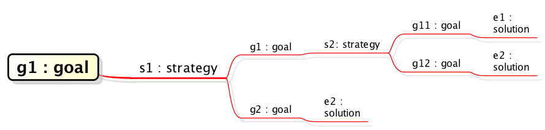
Each topic must have a suffix starting with a colon followed by strings like "goal" or "strategy", which to specify the GSN model type to convert in to. All the supported model types are as follows:
- goal
- strategy
- solution
- context
- assumption
- justification

As I explain later, the plugin supports the following model types and diagrams other than MindMap:
- Classes and Objects in Class diagrams,
- Objects in Activity Diagrams and
- Blcks in Block Definition Diagrams.

The plugin cannot convert to GSN/D-Case models correctly if the relations among models (structure in Mind Map) are incorrect in terms of the GSN syntax.

### Generating GSN/D-Case from a MindMap

1. Select a MindMap you want to convert to GSN/D-Case in the structure tree view.
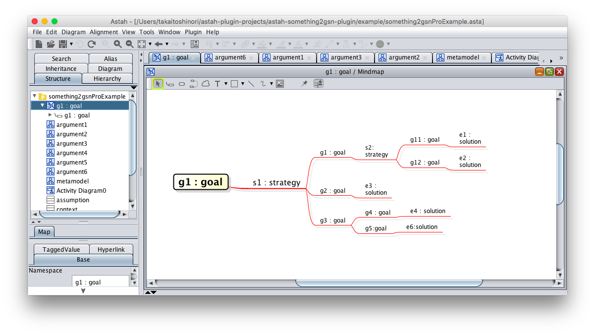
2. From [Tools] menu, choose [GSN Generator] and then [Generating GSN for the current diagram].
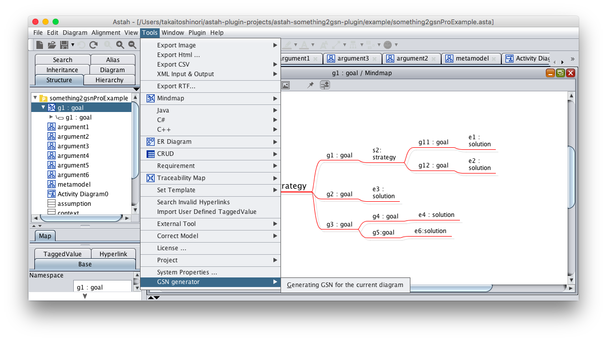
3. A dialog appears to ask you to save this file, name it and save with "xmi" extension.

### Obtaining GSN/D-Case

1. Launch Astah GSN.

2. Open an existing project, or create a new one.
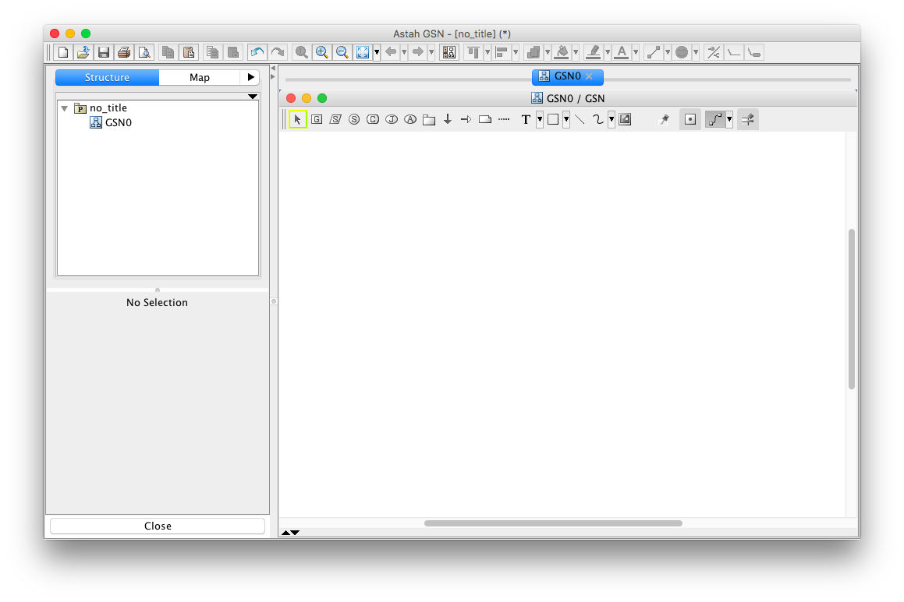
3. From [Tools] menu, choose [XMI] and then [XMI import].
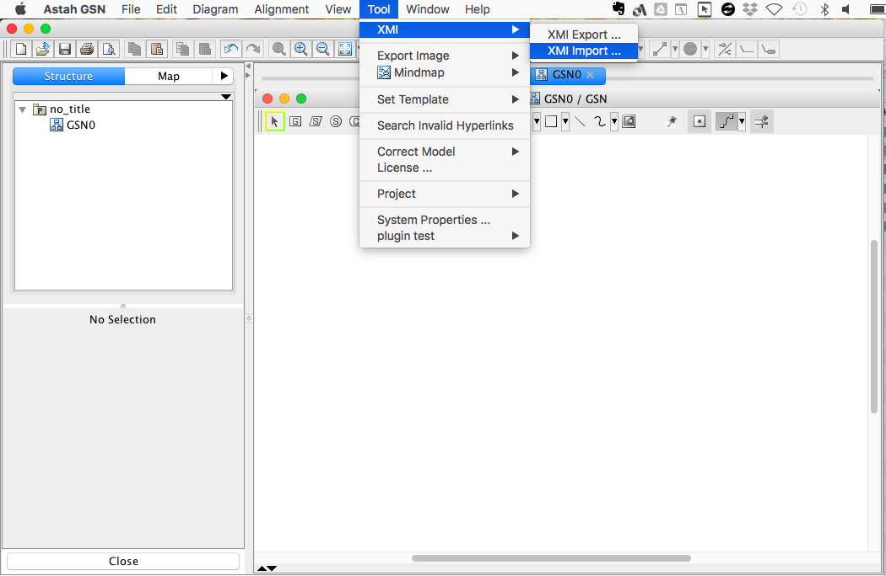
4. A file chooser appears. Select the.xmi file you've generated by this plugin, then imported models will appear in the tree.
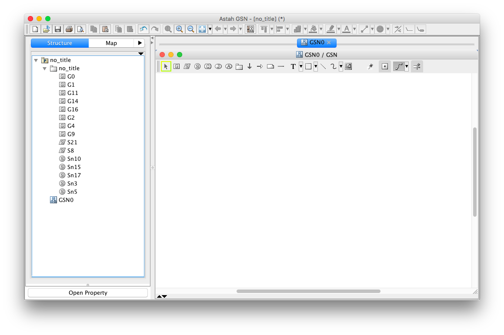
5. So create a new GSN diagram or open an existing one. Drag & drop the models from the tree to GSN diagram to decipt them on the diagram.
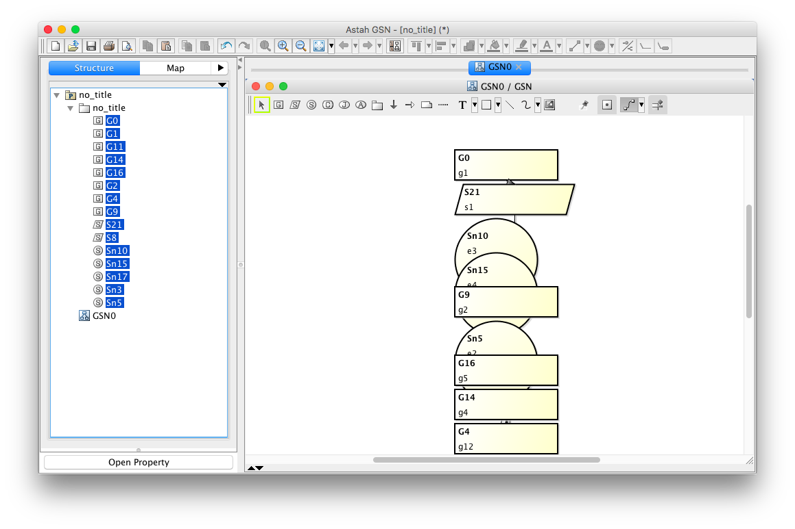
6. Go to [Alignment] - [Auto Layout].
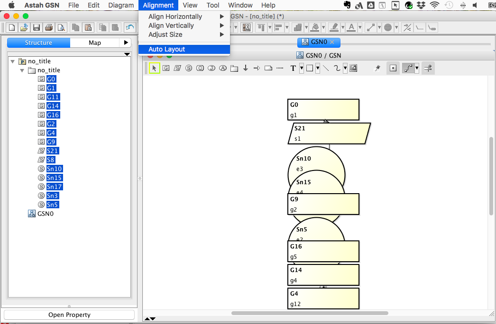
7. GSN-converted models would be aligned nicely keeping its structure.

### Converting from other diagram types than Mind Maps

#### Objects in a class diagram (Astah Professional)
Objects and connected links in the following Class diagram can be converted to GSN. (Note the converted GSN models will lose color setting.) To convert to GSN, all the objects need to have the following class type : "goal", "strategy", "context", "assumption", and "justification", set to specify which GSN model type that you want them convert into.

Here's a sample GSN that was converted from the Class diagram above.

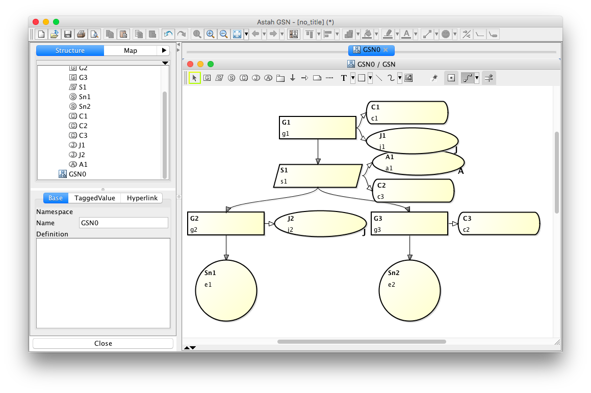

#### Converting Classes in a class diagram (Astah Professional)
Classes and all the associations would be converted to GSN models. Specify which GSN model type to be converted by adding the stereptype.

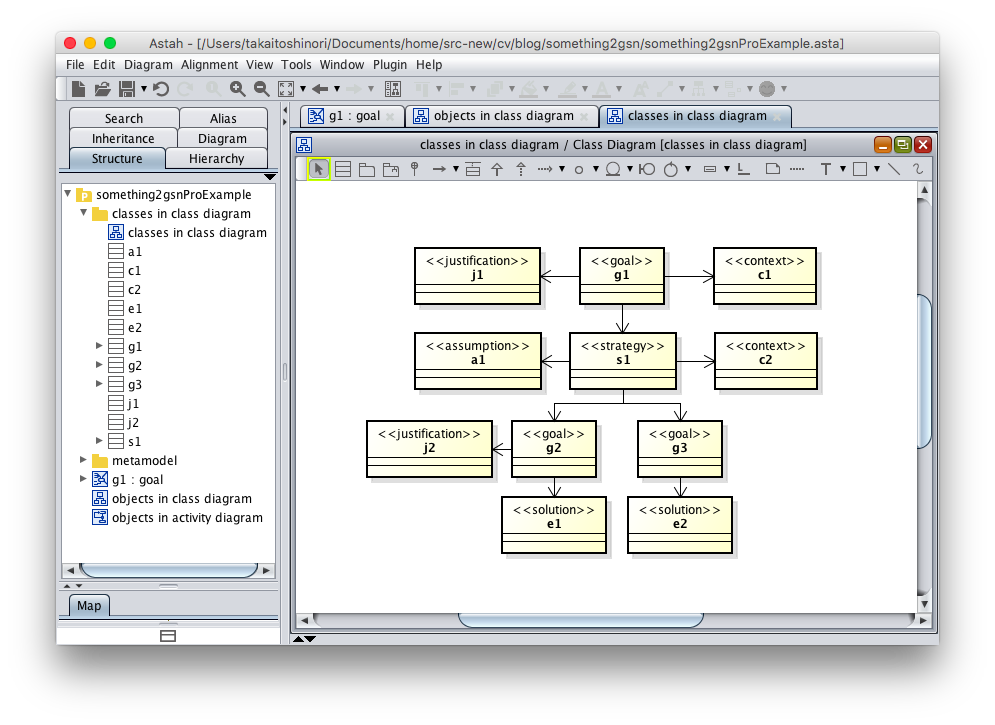

### Converting Objects in activity diagram (Astah Professional and SysML)
Objects and connected relations would be converted to GSN models. All the objects need to have the following class type : "goal", "strategy", "context", "assumption", and "justification", set to specify which GSN model type that you want them convert into, and same goes for Blocks in Astah SysML's activity diagrams.

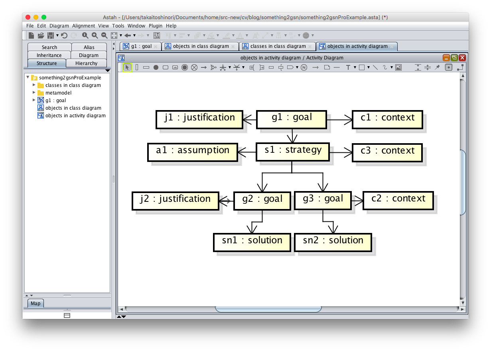

For the case of Astah SysML, the diagram can be as follows.

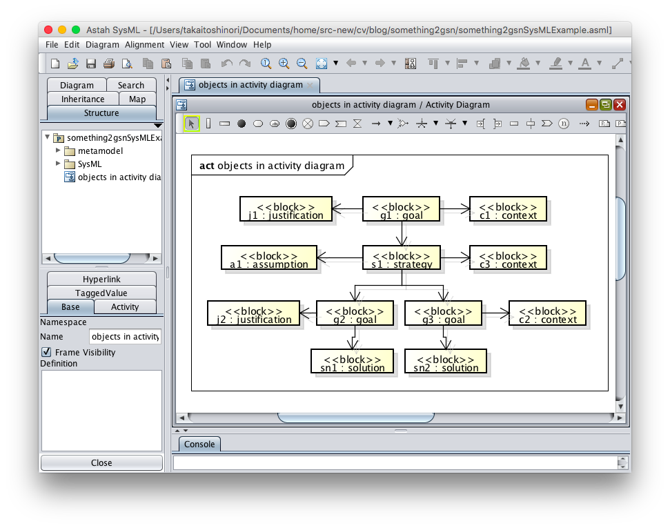

### Converting Blocks in a Block definition diagram (Astah SysML)
Blocks and all the relationships in Block Definition Diagram would be converted to GSN. Add stereotype to specify what GSN model type you want them to convert into.

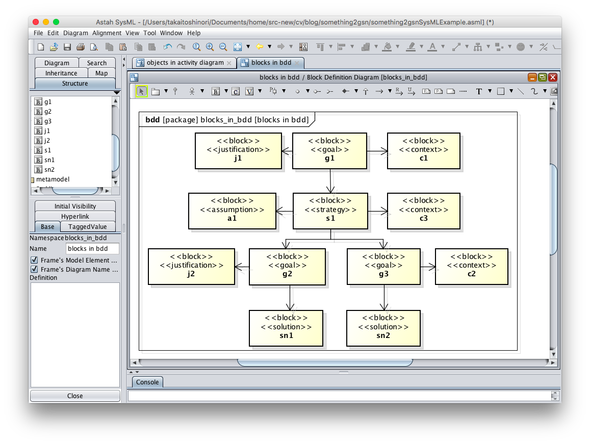

### Others
If necessary, you can re-order the ID number of GSN-converted models by choosing [Reset GSN ID] from the context menu which you can open by right-clickng on the diagram editor.

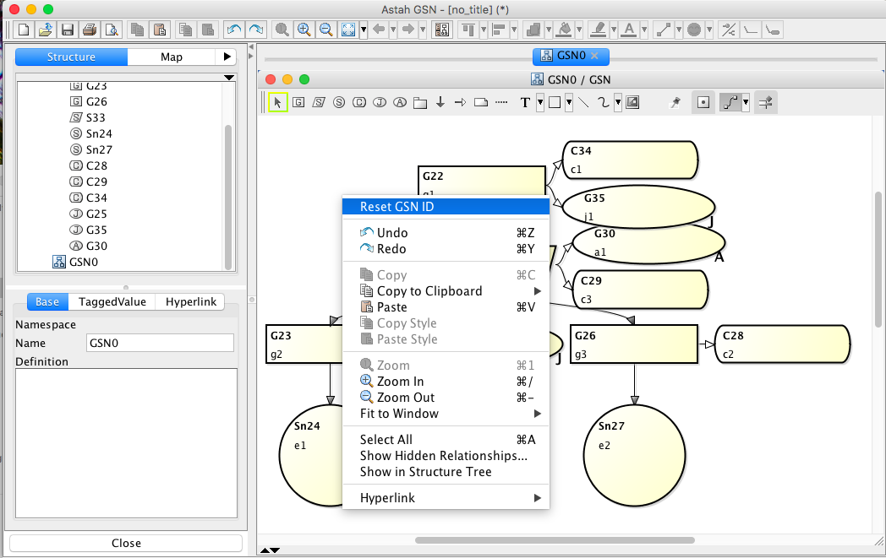

License
---------------
Copyright 2018 Change Vision, Inc.

Licensed under the Apache License, Version 2.0 (the "License");
you may not use this work except in compliance with the License.
You may obtain a copy of the License in the LICENSE file, or at:

   <http://www.apache.org/licenses/LICENSE-2.0>

Unless required by applicable law or agreed to in writing, software
distributed under the License is distributed on an "AS IS" BASIS,
WITHOUT WARRANTIES OR CONDITIONS OF ANY KIND, either express or implied.
See the License for the specific language governing permissions and
limitations under the License.
