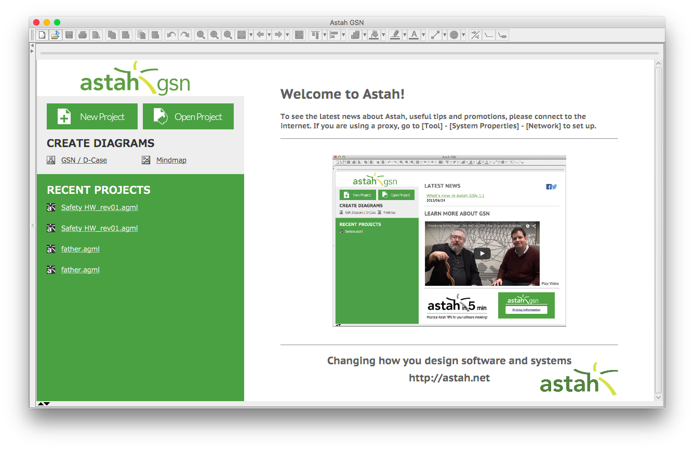
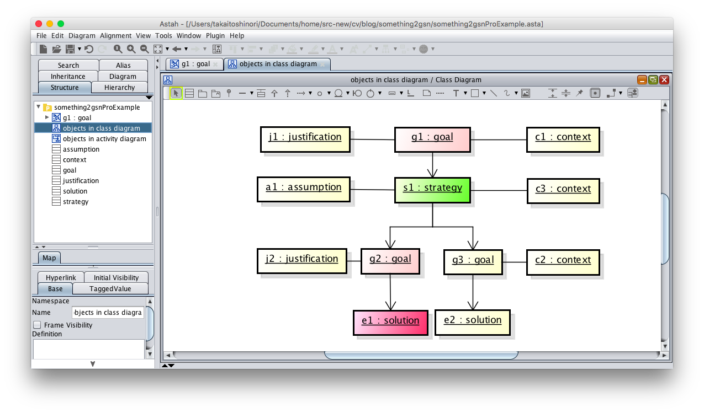

Something2GSN plugin
===============================
Version
----------------
1.0.0

Available for
----------------
Astah UML, professional 6.6 or later, Astah SysML 1.2 or later, Astah GSN 1.1 or later

Description
----------------
The plugin can translate from diagrams, including a MindMap diagram, to GSN.

How to install
----------------
[Download Astah Something2GSN plugin jar file.]()

### [If you are using Astah Professional]
1. Launch Astah and drag the downloaded .jar file to an open instance of Astah. A pop-up will appear asking you to confirm installation, choose [Yes].
3. If the pop-up opens, restart Astah and open any project.
3. Now you will have [GSN generator] item in [Tool] menu.

### [If you are using Astah SysML]
1. Launch Astah and go to [Help] - [Plugin List]
2. Click [Install] button and select the .jar file you downloaded
3. Restart Astah and open any project
3. Now you will have  [GSN generator] item in [Tool] menu.

### [If you are using Astah GSN]
1. Save the downloaded .jar file under Userhome/.astah/gsn/plugins
2. Restart Astah and open any project
3. Now you will have  [GSN generator] item in [Tool] menu.

How to use
----------------
### Creating diagrams
1. For a case of MindMap, the following MindMap diagram can be translated into a GSN diagram:

Here, each topic name must have a suffix starting with a colon followed by strings like "goal" or "strategy", which are representing the node types in a GSN diagram.  All the node types of GSN is as follows:
- goal
- strategy
- solution
- context
- assumption
- justification

Remark that if you give wrong relations between topics in terms of the GSN syntax, the plugin cannot correctly generate GSN.

As we explain later, the plugin supports the following model types and diagrams other than MindMap:
- classes in a class diagram,
- objects in a class diagram,
- objects in an activity diagram, and
- blocks in a block diagram.

Also for these cases, the plugin cannot generate correct GSN/D-Case if the relations among nodes are incorrect in terms of the GSN syntax, as in the case of MindMap.

### Generating GSN/D-Case from a MindMap

1. Select the MindMap diagram you want to translate to GSN/D-Case.

2. From [Tool] menu, choose [GSN Generator] and then [Generating GSN for the current diagram].

3. You will see the file choosing diagram.  Select the file you want to save, or write a file name with the extension name "xmi".

### Obtaining GSN/D-Case

1. Launch Astah GSN.

2. Open an existing project, or create a new project.

3. In [Tool] menu, choose [XMI] and then [XMI import].

4. You will see file choosing diagram.  Choose the xmi file you have generated by this plugin.  After choosing the xmi file, no change can be seen for the Diagram Editor Part but in the "structure tree" part, you will find that some model elements have been added.

5. To obtain a GSN diagram, first select all the model elements in the structure tree and then drag and drop the selected model elements to the diagram editor for GSN. After dropping the model elements, you will see a diagram like the following.

6. In order to align those elements, from [Alignment] menu and choose the item [Auto Layout].

7. You will obtain spatially aligned diagram as follows.

### Translating diagrams other than MindMap
Here we explain the other diagram types that are supported by this plugin.

#### Objects in a class diagram(astah* UML, professional)
The following class diagram with objects and their links can be translated.  Note that the colors of the nodes do not affect the result of translation).  In this case, types of objects should to be prepared as classes like, "goal", "strategy", "context", "assumption", and "justification".

From this class diagram, you can obtain the following GSN with this plugin.

#### Classes in a class diagram (astah* UML, professional)
The following class diagram with classes and their association relations can be translated. In this case, each node should have a stereotype representing a GSN node type.

### Objects in activity diagram (astah* UML, professional, astah* SysML)
The following activity diagram with objects and their relations can be translated.  In this case, types of objects should be prepared as classes (for the case of Astah UML and Astah Professional), or blocks (for the case of Astah SysML) like "goal", "strategy", "context", "assumption", and "justification".

For the case of Astah SysML, the diagram can be as follows.

### Blocks in a block definition diagram (Astah SysML)
The following block definition diagram with blocks and their relations can be translated.In this case, each node should have a stereotype representing a GSN node type.

### Others
Although the identifiers of the nodes in the obtained GSN are not necessarily starting from the minimum number, you can renumber the nodes using the function [Reset GSN ID] of Astah GSN.  Clicking the right mouse button in the empty space in the diagram editor, you will see the context menu.  Choosing [Reset GSN ID] in the context menu, renumbering from the minimum number for all the GSN nodes will be executed.

License
---------------
Copyright 2018 Change Vision, Inc.

Licensed under the Apache License, Version 2.0 (the "License");
you may not use this work except in compliance with the License.
You may obtain a copy of the License in the LICENSE file, or at:

   <http://www.apache.org/licenses/LICENSE-2.0>

Unless required by applicable law or agreed to in writing, software
distributed under the License is distributed on an "AS IS" BASIS,
WITHOUT WARRANTIES OR CONDITIONS OF ANY KIND, either express or implied.
See the License for the specific language governing permissions and
limitations under the License.
