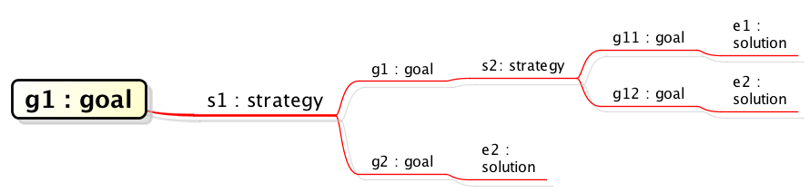
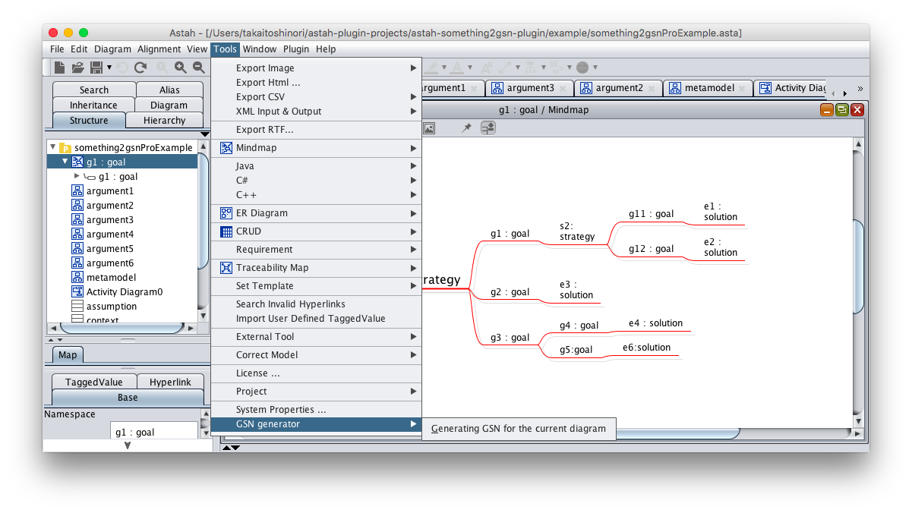
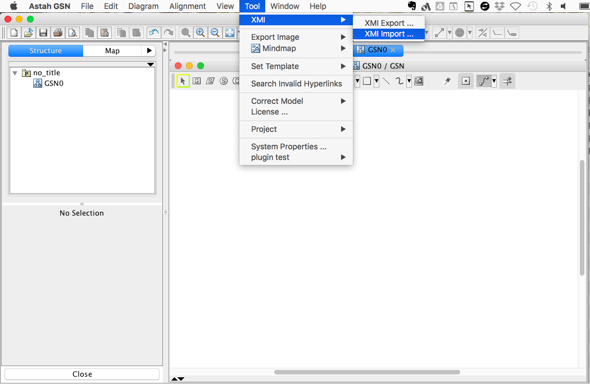
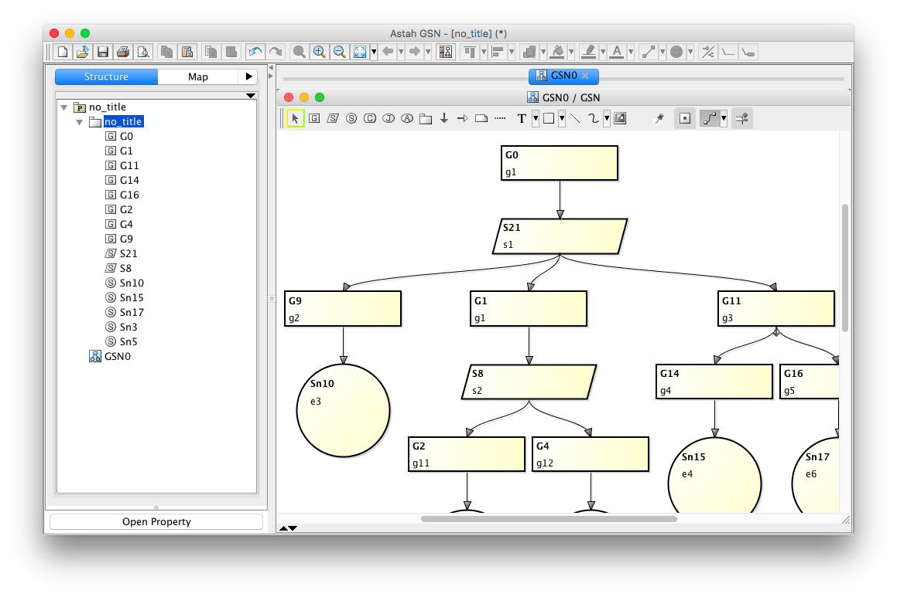
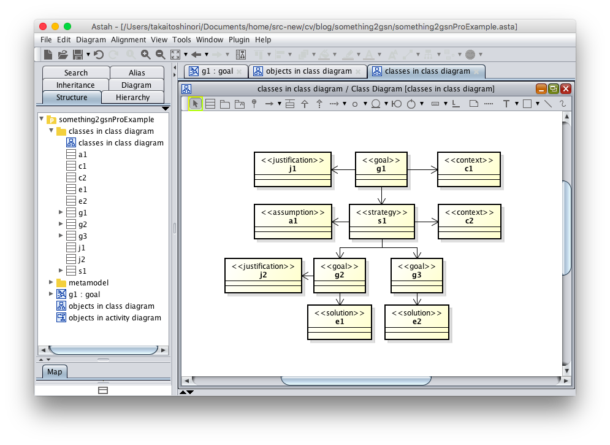

Something2GSNプラグイン
===============================
Version
----------------
1.0.0

Available for
----------------
astah* UML, professional 6.6 以降、astah* SysML 1.2以降、astah* GSN 1.1以降

Description
----------------
マインドマップなどの図からGSN/D-Caseに変換することができます。

How to install
----------------
[ここから、プラグイン.jarファイルをダウンロードします。](http://astah.change-vision.com/plugins/something2gsn/1.0.0.html)

### astah* UML、professional、SysMLをご利用の場合
1. 上部メニュー[ヘルプ] – [プラグイン一覧] からプラグイン一覧を開きます。
2. [インストール] ボタンをクリックし、jarファイルを選択してインストールしてください。
3. astah* を再起動し、プロジェクトを開きます。
4. [Tool]メニューに[GSN generator]が追加されます。

(astah* UML、professional 6.8以降をご利用の場合は、ダウンロードした.jarファイルを、astah*のツールバーにドラッグ＆ドロップすることでもインストールが可能です。)

### astah* GSN をご利用の場合
1. <ユーザホーム>/.astah/gsn/pluginsフォルダに本プラグインのjarファイルを置きます。
2. astah*を起動し、プロジェクトを開きます。
3. 下部の拡張ビューに[GSN generator]タブが追加されます。

使い方
----------------
### 図の作成
1. マインドマップの場合は、例えば、次のようなものが変換できます。

ここで、各トピック名は、「goal」や「strategy」のような、GSN/D-Caseにおけるノードの種類を表す文字列がコロンの後に付加されている必要があります。GSN/D-Caseのノードの種類は以下の通りです。
- goal
- strategy
- solution
- context
- assumption
- justification

また、トピック間の関係は、GSN/D-Caseとして正しいものしか正しく変換できません。

詳しくは後述しますが、マインドマップ以外の図は、次のようなものをサポートしています。
- クラス図におけるクラスによるGSN/D-Caseの表現
- クラス図におけるオブジェクトによるGSN/D-Caseの表現
- アクティビティ図におけるオブジェクトによるGSN/D-Caseの表現
- ブロック定義図におけるブロックによるGSN/D-Caseの表現

これらについても、マインドマップと同じく、ノード間の関係がGSN/D-Caseとして正しいものしか正しく変換できません。

### マインドマップからGSN/D-Caseを生成する

1. GSN/D-Caseに変換したいマインドマップを選択します。

2. メニューの[Tool]から、[GSN Generator]を選択し、さらに[Generating GSN for the current diagram]を選びます。

3. ファイル選択画面が現れますので、ここで、セーブしたいファイル名を選択、または指示してください。拡張子は、xmiとしてください。

### GSN/D-Caseを表示する。

1. astah* GSN/D-Caseを立ち上げてください。

2. 既存プロジェクト、または新規プロジェクトを開いてください。

3. メニュー[Tool]から、[XMI]を選択し、[XMI import]を選んでください。

4. ファイルを選択する画面が現れますので、ここで、先ほどセーブした、拡張子がxmiのファイルを選択してください。選択すると、図表示は変化しませんが、構造ツリーにはモデル要素が追加されているはずです。

5. GSN/D-Caseの図を表示するためには、まず、先ほど追加されたモデル要素を構造ツリー上で全て選択し、ドラッグアンドドロップで図上に配置します。配置した直後は次のような感じになっていると思います。

6. 図上の自動配列をするため、[Alignment]メニューから[Auto Layout]を選びます。

7. 自動配列された図が得られます。

### マインドマップ以外の図から変換する
ここでは、マインドマップ以外の図で、本プラグインで対応しているものについて説明します。
#### クラス図におけるオブジェクト(astah* UML, professional)
次のようなクラス図におけるオブジェクトとその間のリンク関係が変換可能です(図要素の色は関係ありません)。ここで、あらかじめクラスとして、goal、strategy、context、assumption、justificationを必要に応じて用意しておきます。
  
  変換後は次のようなGSN/D-Caseが得られます。
  

#### クラス図におけるクラス(astah* UML, professional)  
次のようなクラス図におけるクラスとその間の関係が変換可能です。この場合は、各クラスのステレオタイプに、GSN/D-Caseのノードタイプの情報を記述しておいてください。
  

### アクティビティ図におけるオブジェクト(astah* UML, professional, astah* SysML)
次のようなアクティビティ図におけるオブジェクトとその間の関係が変換可能です。この場合は、あらかじめクラス（astah* UML及び astah* Professionalの場合）またはブロック（astah* SysMLの場合）として、goal、strategy、context、assumption、justificationを必要に応じて用意しておきます。
  
  astah* SysMLの場合は次のような表示になり得ます。
  

### ブロック定義図におけるブロック(astah* SysML)
  次のようなブロック定義図におけるブロックとその間の関係が変換可能です。この場合は、各クラスのステレオタイプに、GSN/D-Caseのノードタイプの情報を記述しておいてください。
    

### その他
* 変換後のGSN/D-Caseのノードの識別子は、必ずしも最小の数字から始まるものではありませんが、astah* GSN/D-Caseの機能である[Reset GSN ID]を用いれば、簡単に識別子の数字を振り直すことができます。図上の空白部分で、右クリックにより表示されるコンテキストメニューから[Reset GSN ID]を実行することができます。

License
---------------
Copyright 2018 Change Vision, Inc.

Licensed under the Apache License, Version 2.0 (the "License");
you may not use this work except in compliance with the License.
You may obtain a copy of the License in the LICENSE file, or at:

   <http://www.apache.org/licenses/LICENSE-2.0>

Unless required by applicable law or agreed to in writing, software
distributed under the License is distributed on an "AS IS" BASIS,
WITHOUT WARRANTIES OR CONDITIONS OF ANY KIND, either express or implied.
See the License for the specific language governing permissions and
limitations under the License.
